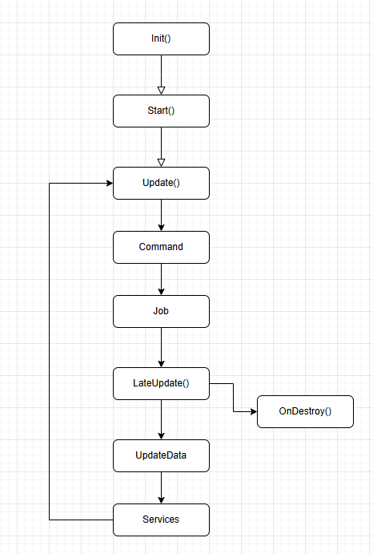

# Порядок выполнения функций событий

- **Init()**: метод в скрипте, выполняющийся один раз при инициализации объекта. Он используется для подготовки объекта перед началом работы.

- **Start()**: метод в скрипте, выполняющийся один раз при инициализации объекта. Он обычно используется для начальной настройки и активизации компонентов после их инициализации.

- **Update()**: метод в скрипте, выполняющийся каждый тик. Здесь происходит обновление логики объекта, например, перемещение, проверка состояния и т.д.

- **Command**: обработка команд, полученных игровым объектом. Эти команды могут быть переданы в объект для выполнения в рамках одного цикла обработки.

- **Job**: выполнение кода после оператора `await`, если задача внутри `job` выполнена. Этот метод используется для асинхронных операций, которые могут выполняться параллельно с другими задачами.

- **LateUpdate()**: метод в скрипте, выполняющийся каждый тик, но после всех вызовов `Update()`. Он предназначен для выполнения логики, которая должна зависеть от изменений, произошедших в ходе обработки в `Update()`.

- **OnDestroy()**: метод в скрипте, выполняющийся один раз при удалении объекта или компонента. Этот метод используется для очистки ресурсов и завершения работы объекта.

- **UpdateData**: считывание данных в потокобезопасный буфер. Этот метод необходим для работы с многозадачностью, где важно обеспечить безопасность доступа к данным.

- **Services**: обработка логики сервисов. Этот этап отвечает за выполнение задач, таких как синхронизация данных между объектами, работа с внешними сервисами и т.д.

